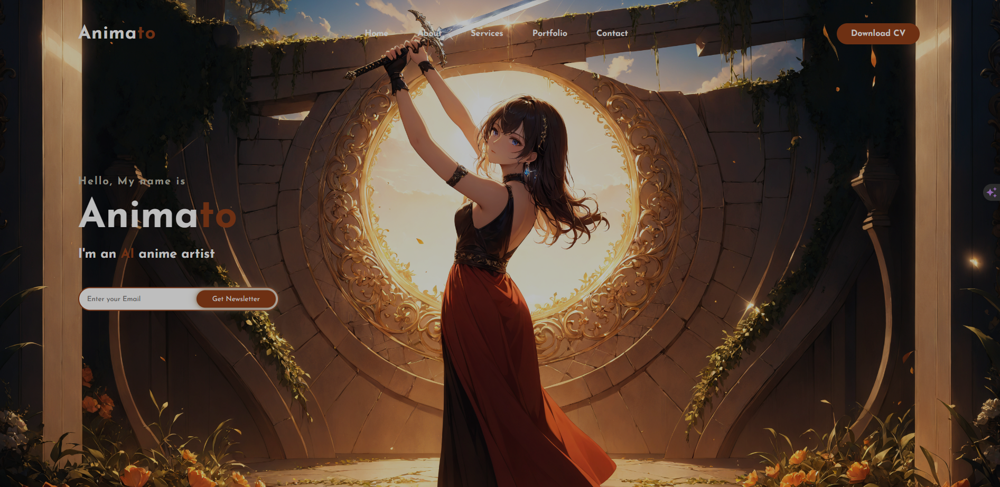

<h3 align="center">Animato: Your Anime-Inspired Portfolio</h3>

<p align="center">
  <a href="" rel="noopener">
 </a>
</p>

This repository houses the source code for **Animato**, your vibrant, anime-themed portfolio website built with HTML and vanilla CSS. Get ready to showcase your skills, projects, and contact information in style!

**Features:**

- **Anime-Themed Design:** Captivate your audience with a visually striking aesthetic inspired by your passion for anime.
- **Responsive Layout (In Progress):** Soon, your portfolio will adapt flawlessly to various screen sizes, ensuring optimal viewing on any device.
- **Intuitive Navigation:** Guide users through your content with a clear and user-friendly structure.
- **Customizable Content:** Personalize your portfolio to reflect your unique personality and accomplishments.
- **Smooth Animations and Transitions (Optional):** Enhance engagement with subtle visual effects (implement responsibly for performance optimization).

**Getting Started:**

1. **Clone the repository:**

   ```bash
   git clone https://github.com/MudabbirulSaad/animato-portfolio.git
   ```

2. **Open the project in your preferred code editor.**

3. **Make it your own:**

   - Modify the HTML files to incorporate your details, project descriptions, and skill sets.
   - Replace placeholder images with your own anime-related visuals.

4. **View your portfolio:**

   - Open `index.html` in your web browser.

**Technologies Used:**

- HTML
- CSS

**Contributing:**

We encourage contributions to elevate Animato! Feel free to fork the repository, make your changes, and submit a pull request.

**License:**

This project is licensed under the MIT License (see the `LICENSE` file for specifics).

**Additional Considerations:**

- **Responsive design implementation:** Once completed, update the README to highlight its functionality and benefits.
- **Optional animations:** If you choose to add animations, exercise caution to maintain optimal performance, especially on low-bandwidth connections.
- **Clear instructions:** Provide concise and helpful guidance throughout the README to effectively assist users.

We hope this refined README.md empowers you to showcase your skills and passion with your captivating anime-inspired portfolio!
